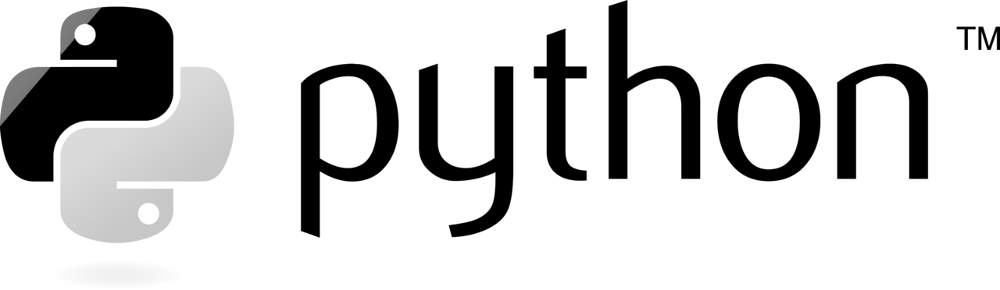

# Spectrology-Fork

Spectrology-Fork is based on [spectrology](https://github.com/solusipse/spectrology) that adds parallel processing for faster execution and support to build a linux-compiled executable of the spectrology.py script.

The executable is standalone and does not require any additional dependencies or even Python.

Sprectrology is a Python script that can create audio stegano i.e., Images to audio files with corresponding spectrograms encoder.

P.S. since Pyinstaller is not a cross-compiler: to make a Windows app you run PyInstaller in Windows; and likewise for Mac.

## Usage
- via the executable
    ```bash
    $ exec/spectrology [-h] [-r] [-o OUTPUT] [-b BOTTOM] [-t TOP] [-p PIXELS][-s SAMPLING] INPUT
    ```
- via Python Script
    ```bash
    python spectrology.py [-h] [-r] [-o OUTPUT] [-b BOTTOM] [-t TOP] [-p PIXELS][-s SAMPLING] INPUT

    ```

<details>
<summary>Positional Arguments</summary>
<br>

```
    positional arguments:
    INPUT                 Name of the image to be convected.

    optional arguments:
    -h, --help            show this help message and exit
    -r, --rotate          Rotate image 90 degrees.
    -o OUTPUT, --output OUTPUT
                          Name of the output wav file. 
                          Default value: out.wav.
    -b BOTTOM, --bottom BOTTOM
                          Bottom frequency range. 
                          Default value: 200.
    -t TOP, --top TOP     Top frequency range. 
                          Default value: 20000.
    -p PIXELS, --pixels PIXELS
                          Pixels per second. 
                          Default value: 30.
    -s SAMPLING, --sampling SAMPLING
                          Sampling rate. 
                          Default value: 44100.
```

</details>


## Rebuilding the executable (OS Independent)
To build the executable, you need to have PyInstaller installed. The following steps will guide you through the process of building the executable for Linux.
1. Install the requirements (PyInstaller)
    ```bash
    pip install -r exec/requirements.txt
    ```
    For more infor on PyInstaller, check the [PyInstaller GitHub Page](https://github.com/pyinstaller/pyinstaller).
2. Build the executable
    ```bash
    pyinstaller -F spectrology.py
    ```
3. The executable will be created in the `dist` folder.
4. To run the executable, use the command:
    ```bash
    /dist/spectrology
    ```
5. You can save the executable somewhere else and run it from there. The executable is standalone and does not require any additional dependencies or even Python.
    For example, you can add it to your PATH and run it from anywhere.

## Example



For more informations on this techique, see this article: https://solusipse.net/blog/post/basic-methods-of-audio-steganography-spectrograms/.


## License
This project is licensed under the MIT License - see the [LICENSE](LICENSE) file for details.